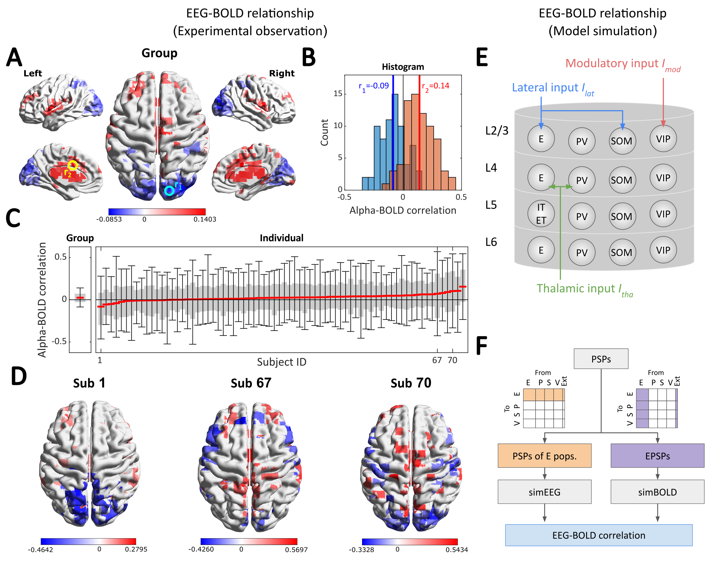

## Long-Range Input To Cortical Microcircuits Shapes EEG-BOLD Correlation

Although generated by different mechanisms, electroencephalography (EEG) rhythms and blood-oxygen-level-dependent (BOLD) activity have been shown to be correlated. The level of correlation varies between EEG frequency bands, brain regions, and experimental paradigms, but the underpinning mechanisms of this correlation remain poorly understood. Here we create a mathematical, data-informed model of a cortical microcircuit that encompasses all major neuron types across cortical layers, and use it to generate EEG and BOLD under various external input conditions. The model exhibits noise-driven fluctuations mimicking EEG rhythms, with external inputs modulating EEG spectral characteristics. Consistent with experimental results, we observe negative alpha-BOLD correlation and positive gamma-BOLD correlation across different input configurations. Temporal variability of the input is found to increase EEG-BOLD correlation and to improve the correspondence with experimental results. This study provides a mathematical framework to theoretically study the correlation of EEG and BOLD features in a comprehensive way.

Preprint: https://doi.org/10.1101/2025.06.06.658058

  

## Reproducing the figures

The scripts are organized so that each is named after the figure it reproduces. 

(Scripts ending in `_batch` run the underlying simulations and save intermediate results to `data/`. The corresponding plotting script then loads these results to generate the figure.)

| Manuscript Figure | Description | Script(s) to run |
|---|---|---|
| Fig 1 | Empirical alpha-BOLD correlation (EEG-fMRI dataset) | `fig1.m` |
| Fig 2 | EEG power spectra and BOLD amplitude across the input space | `fig2_batch.m` → `fig2.m` |
| Fig 3 | EEG-BOLD correlations under constant and varying input | `fig3_batch.m` → `fig3.m`|
| Fig 4 | Reproducing the LFP-BOLD correlation from Magri et al. | `fig4.m`|
| Fig 5 | Relationship between EEG spectra and PSPs | `fig5_batch.m` → `fig5.m`|
| Fig 6 | Similarity between population activity and alpha/gamma-BOLD correlations | `fig6.m`|
| Fig S1 | Determining the optimal number of K-means clusters | (part of `fig2.m`) |
| Fig S2 | Relationship between EEG bands and BOLD (mean/std) | `figS2.m` |
| Fig S3 | Analysis of dipole effect on EEG-BOLD correlation | `figS3.m` |
| Fig S4–S6 | Alpha-gamma switching / smooth input / increased lateral input examples | `figS4.m`, `figS5.m`, `figS6.m` |
| Fig S7 | Population-level firing rates and power spectra | `figS7.m`|
| Fig S8–S9 | Effect of external input variability on EEG-BOLD correlation | `figS8_batch.m` → `figS8.m`; `figS9.m`|
| Fig S10 | BOLD responses to selective stimulation of interneuron subtypes | `figS10.m`, `figS10_scan.m` |
| Fig S11 | Group-level alpha-BOLD correlation map, masked by statistical significance |  |
> **Note:** Some scripts depend on outputs from earlier steps. For example, `fig3.m`, `figS3.m`, `figS8.m`, and `figS9.m` require `data/fig2_kmeans8.mat` (produced by `fig2.m`) to be present.

## Large files not included in this repository

Due to GitHub's file size limits, the following intermediate result files are **not included** in this repository. 

They can be regenerated by running the corresponding `_batch.m` script. (It may take some amount of time.)

| File | Approx. size | Generated by |
|---|---|---|
| `data/fig2_batch_result.mat` | ~122 MB | `fig2_batch.m` |
| `data/fig5_batch_result.mat` | ~1.76 GB | `fig5_batch.m` |
| `data/randWalk_input_speed5_mv0.mat` | ~1.33 GB | generated automatically the first time a script calling `load_input()` is run, if not already present. |
| `data/randWalk_input_speed5_mv5.mat` | ~1.20 GB | same as above |
